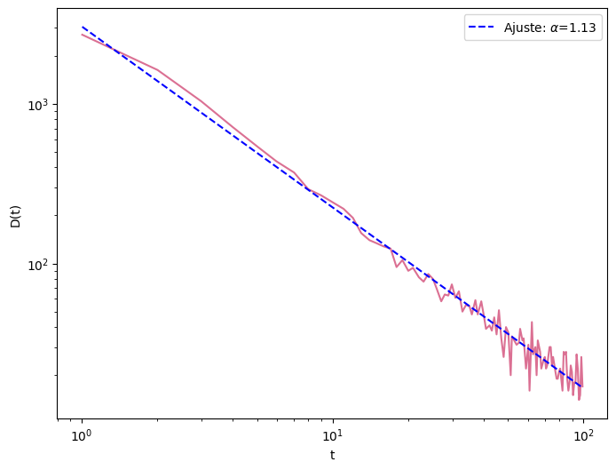
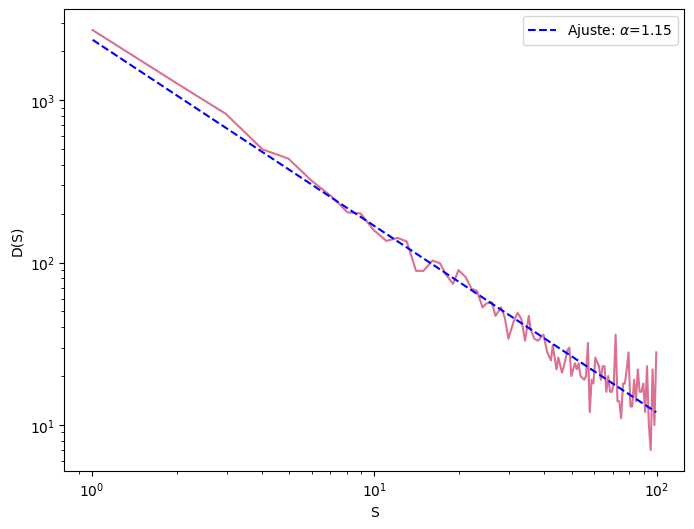
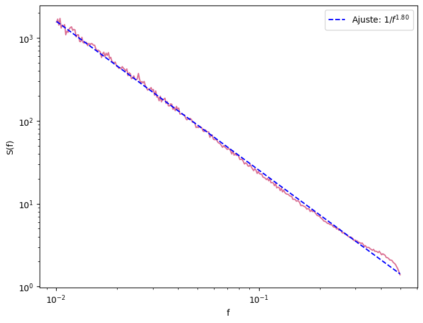
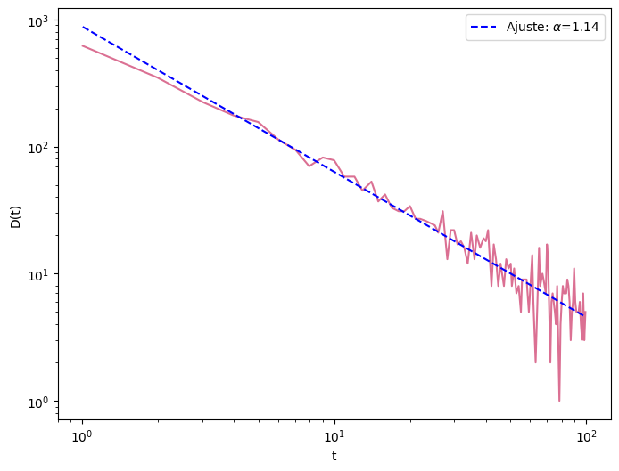
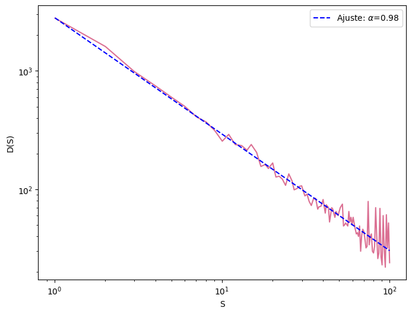
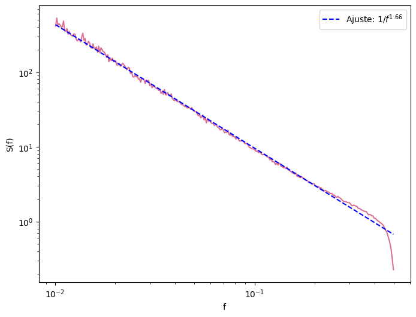
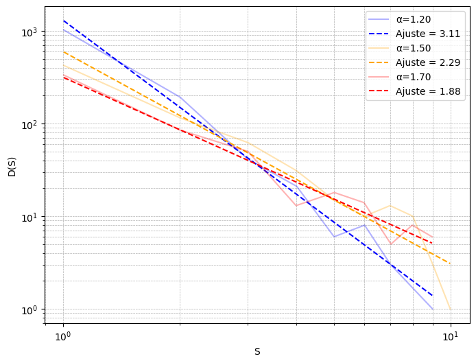

# From grains of sand to neuronal avalanches

### Reproducing papers of Self-Organized Criticality

> *How can simple local interactions generate complex behavior without external tuning?*

This repository reproduces two landmark papers that shaped our understanding of **Self-Organized Criticality (SOC)** and its application to **Computational Neuroscience**.

Starting from the classical **Bak-Tang-Wiesenfeld (1987)** sandpile model and continuing to the biologically-inspired **Levina et al. (2007)** neural network model, this project explores how scale-free dynamics emerge from simple local rules.

---

## Motivation

Self-Organized Criticality is one of the central ideas in Complex Systems.

The original sandpile model demonstrated that a system composed of extremely simple rules can naturally evolve toward a critical state characterized by

- scale-free avalanches,
- power-law distributions,
- absence of characteristic scales,
- emergent complexity.

Years later, these same ideas reached neuroscience after the discovery of **neuronal avalanches**, suggesting that cortical activity may operate near a critical point.

This repository reproduces both models and connects them through simulations, visualization, and statistical analysis.

---

# Repository Overview

---

# Contents

- Introduction to Self-Organized Criticality
- Bak-Tang-Wiesenfeld Sandpile Model
- Avalanche Dynamics
- Power-law Analysis
- Two-dimensional vs Three-dimensional Sandpiles
- Dynamic Synapses (Levina et al.)
- Connection to Neuronal Avalanches
- Discussion
- References

---

# 1. Self-Organized Criticality (SOC)

Many physical systems naturally evolve toward a critical state without requiring external parameter tuning.

Unlike classical phase transitions, where a control parameter must be adjusted precisely, SOC systems spontaneously organize themselves near the critical point.

Their main signatures include

- long-range correlations
- scale invariance
- avalanche dynamics
- power-law distributions

The sandpile model is the canonical example.

---

# 2. Bak-Tang-Wiesenfeld Sandpile Model

The first part of this project reproduces the seminal **Bak-Tang-Wiesenfeld (1987)** model, the first mathematical model to demonstrate **Self-Organized Criticality (SOC)**.

The model consists of a square lattice where each cell stores an integer number of sand grains. At every iteration, a new grain is added to the system. Whenever the number of grains at a site exceeds a critical threshold, that site becomes unstable and topples, redistributing grains to its four nearest neighbors.

Although the local rule is remarkably simple, repeated grain addition drives the entire system toward a critical state where events of all sizes naturally emerge.

Unlike classical critical phenomena, no external parameter needs to be tuned. Criticality appears spontaneously as a consequence of the system dynamics.

---

# Local Dynamics

The simplest way to understand the model is to imagine continuously pouring sand onto the top of a real sandpile.

At first, the pile simply grows. As more grains accumulate at the center, the local slope increases until it becomes unstable. A small portion of the pile collapses, redistributing sand to neighboring regions.

The computational model reproduces exactly this intuition.

To illustrate this process, grains are repeatedly deposited onto the central cell of a **20×20 lattice**.

Initially, avalanches remain localized near the deposition site. As neighboring cells gradually approach the critical threshold, the activity spreads outward, producing increasingly larger cascades.

<p align="center">

</p>

<p align="center">
<i>Figure 1. Sand grains are continuously added to the central cell of a 20×20 lattice. Early avalanches remain confined near the center, while progressively larger cascades emerge as the pile grows.</i>
</p>

This visualization captures the essential mechanism behind Self-Organized Criticality: simple local interactions generate complex collective behavior without centralized control.

---

# Emergence of Scale-Free Avalanches

Once the local dynamics become established, the system evolves toward a stationary state where avalanches occur continuously across multiple spatial scales.

Most avalanches involve only a few lattice sites, while a much smaller number propagate through large portions of the system.

Importantly, there is no characteristic avalanche size.

This absence of a preferred scale is one of the defining signatures of Self-Organized Criticality.

The following figures reproduce the avalanche statistics measured from the **20×20 simulation**.

<p align="center">



</p>

<p align="center">
<i>Figure 2. Avalanche duration (left), avalanche size (center), and fractal dimension (right) obtained from the 20×20 simulation.</i>
</p>

Although the system is relatively small, the distributions already exhibit the broad variability expected from critical systems.

---

# Large-Scale Dynamics

To reduce finite-size effects and better reproduce the original publication, the lattice size was increased to **50×50**, following the initialization procedure described in the original paper.

The larger system reveals a much richer dynamical behavior.

Small avalanches remain the most common events, while occasional large cascades propagate through nearly the entire lattice.

<p align="center">

</p>

<p align="center">
<i>Figure 3. Avalanche dynamics in a 50×50 lattice. Increasing system size allows larger cascades to emerge while preserving the same local interaction rules.</i>
</p>

As expected, increasing the lattice size makes the scale-free behavior more evident.

The corresponding avalanche statistics are shown below.

<p align="center">



</p>

<p align="center">
<i>Figure 4. Avalanche duration (left), avalanche size (center), and fractal dimension (right) measured from the 50×50 simulation.</i>
</p>

Compared to the smaller lattice, the scaling region extends over a wider range, illustrating how finite-size effects influence the estimation of critical exponents.

## Discussion

Although the fitted exponents differ from those reported in the original publication, all simulations consistently exhibit power-law behavior across multiple orders of magnitude.

Several factors can explain these differences:

- finite-size effects
- stochastic initialization
- simulation length
- transient removal
- fitting interval
- estimation methodology
- boundary conditions

Obtaining a different exponent does **not** necessarily imply that the model failed to reproduce the original phenomenon.

Instead, it illustrates one of the most important aspects of statistical physics:

> Estimating power-law exponents is highly sensitive to finite-size effects and statistical methodology.

Future improvements could include

- Maximum Likelihood Estimation
- Kolmogorov-Smirnov goodness-of-fit tests
- finite-size scaling analysis
- comparison against alternative distributions

---

# 5. From Sandpiles to the Brain

The sandpile model naturally raises an important question.

If criticality requires precise tuning, how could biological systems remain close to the critical point?

The brain has no external observer adjusting parameters.

So what mechanism could maintain criticality autonomously?

This question motivated the work of **Levina et al. (2007)**.

---

# 6. Dynamic Synapses

The second part of this repository reproduces

> Levina, Herrmann & Geisel (Nature Physics, 2007)

Instead of sand grains, the system now consists of integrate-and-fire neurons connected through **dynamic synapses**.

Unlike previous models requiring fine tuning, synaptic efficacy changes automatically according to neuronal activity.

Each spike

- consumes synaptic resources
- weakens the connection
- allows gradual recovery afterward

This adaptive mechanism naturally drives the network toward criticality.

<p align="center">

</p>


---

# Model Overview

```
External Input
        │
        ▼
 Neuron fires
        │
        ▼
Synaptic depression
        │
        ▼
Spike propagation
        │
        ▼
Avalanche
        │
        ▼
Recovery
        │
        └───────────────┐
                        │
                        ▼
               Self-organization
```

---

# Results

The reproduced simulations recover the three dynamical regimes described in the original publication:

- subcritical
- critical
- supercritical

By varying the maximum synaptic strength parameter (α), the avalanche distribution transitions from exponential behavior to scale-free dynamics and eventually to system-wide avalanches.

<p align="center">

</p>

---

# Sandpile vs Neural Networks

| Sandpile | Neural Network |
|-----------|----------------|
| Sand grains | Neurons |
| Cell height | Membrane potential |
| Toppling | Spike generation |
| Grain redistribution | Synaptic transmission |
| Avalanche | Neuronal avalanche |
| Local conservation | Synaptic dynamics |
| Critical state | Critical brain dynamics |

Although the microscopic mechanisms differ, both systems exhibit remarkably similar macroscopic behavior.

---

# Relevance to Neuroscience

Experimental recordings have shown that spontaneous cortical activity often appears as **neuronal avalanches** whose sizes approximately follow a power-law distribution.

Critical dynamics have been associated with

- maximal dynamic range
- optimal information transmission
- efficient information storage
- increased computational capability
- robust responsiveness to external stimuli

The Levina model provides a biologically plausible mechanism explaining how neural systems could self-organize toward this regime without requiring external parameter tuning.


# References

Bak, P., Tang, C., & Wiesenfeld, K. (1987). *Self-Organized Criticality: An Explanation of 1/f Noise.*

Levina, A., Herrmann, J. M., & Geisel, T. (2007). *Dynamical Synapses Causing Self-Organized Criticality in Neural Networks.*

Beggs, J. M., & Plenz, D. (2003). *Neuronal Avalanches in Neocortical Circuits.*

---
# Author

**Emilio Hernández Vargas**
B.Sc. Neuroscience — National Autonomous University of Mexico (UNAM)

> *Simple rules can produce extraordinary complexity. Understanding those rules is the first step toward understanding the brain.*


